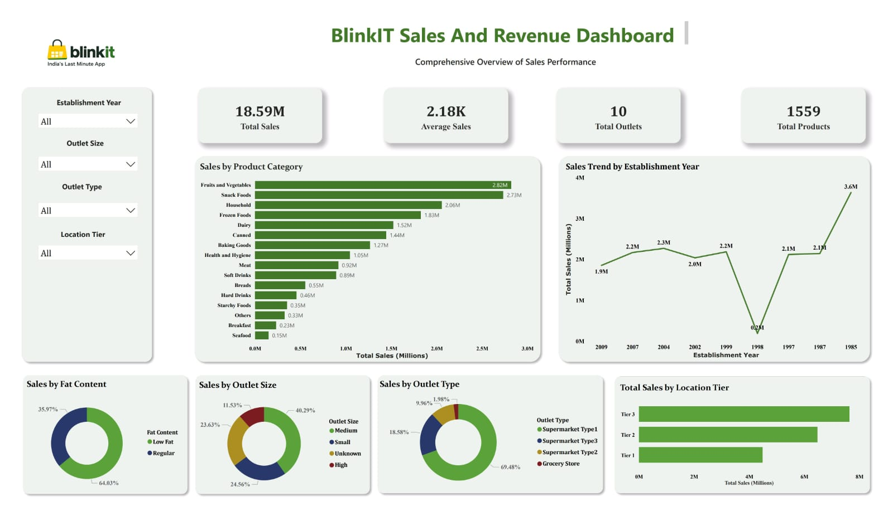

# BlinkIT-Sales-Revenue-Dashboard
Interactive Power BI dashboard for BlinkIT sales analysis using Power Query, DAX, KPI cards, charts, and slicers.
# 🛒 BlinkIT Sales & Revenue Dashboard

## 📌 Project Overview

This project presents an interactive **BlinkIT Sales & Revenue Dashboard** built using **Microsoft Power BI**. The dashboard provides valuable business insights by analyzing sales performance, outlet performance, product categories, and customer trends through interactive visualizations.

---

## 🎯 Project Objectives

- Analyze overall sales performance
- Track sales trends over time
- Identify top-performing product categories
- Compare outlet performance
- Analyze sales by outlet size and location
- Build an interactive dashboard using Power BI

---

## 🛠️ Tools & Technologies

- Microsoft Power BI
- Power Query
- DAX (Data Analysis Expressions)
- Microsoft Excel

---

## 📊 Dashboard Features

- KPI Cards
  - Total Sales
  - Average Sales
  - Total Products
  - Total Outlets

- Interactive Slicers
  - Establishment Year
  - Outlet Type
  - Outlet Size
  - Location Tier

- Visualizations
  - Sales by Product Category
  - Sales Trend by Establishment Year
  - Sales by Outlet Type
  - Sales by Outlet Size
  - Sales by Location Tier
  - Sales by Fat Content

---

## 📈 Key Business Insights

- Identified the highest-performing product categories.
- Compared outlet performance across different outlet types.
- Analyzed sales trends over establishment years.
- Evaluated sales contribution by outlet size and location tier.
- Built an interactive dashboard for business decision-making.

---

## 📂 Project Files

- BlinkIT_Sales_Revenue_Dashboard.pbix
- BlinkIT_Dataset.xlsx
- Dashboard.png

---

## 👨‍💻 Author

**Yuga Madhavan G S**

Aspiring Data Analyst | Power BI | Excel | SQL | Data Visualization
